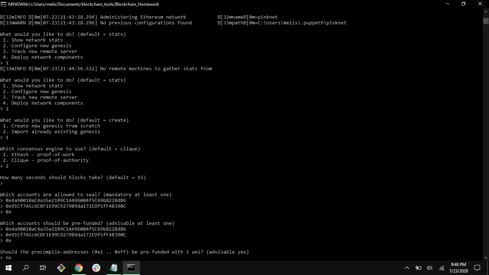
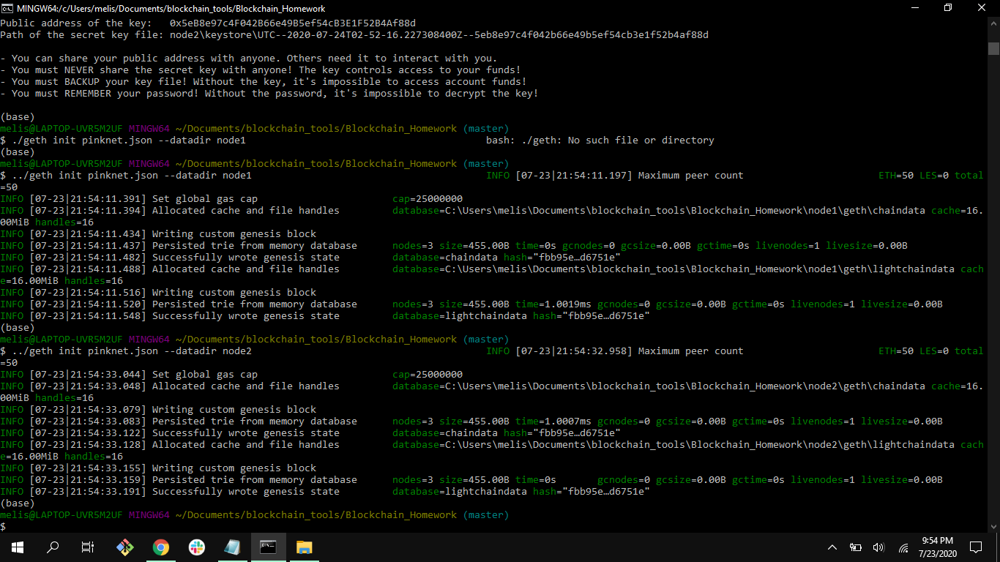
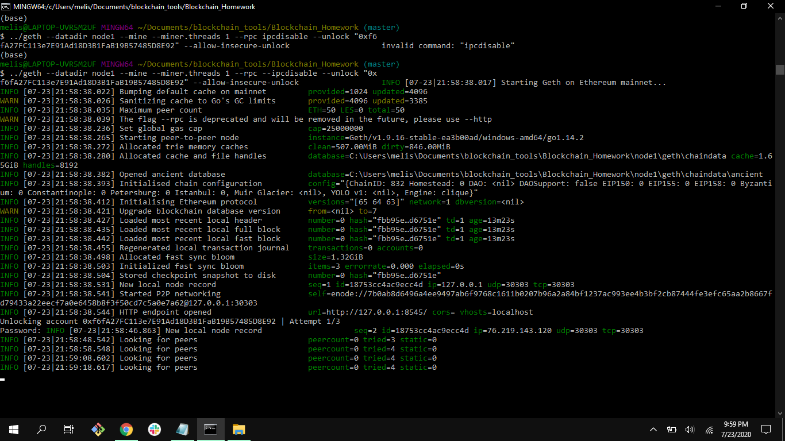
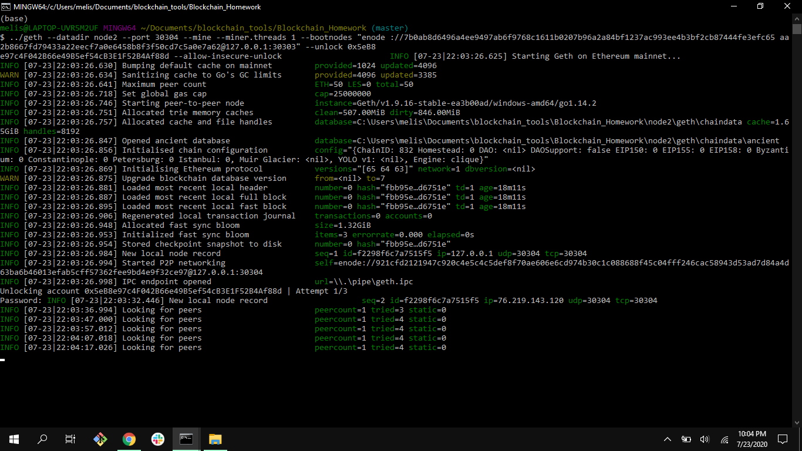
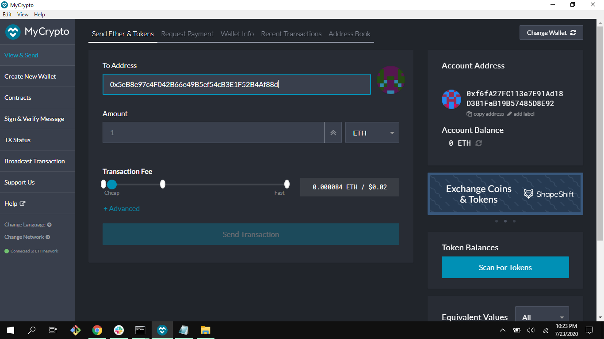

# Blockchain_Homework

## 1. Create Network using puppeth 

## 2. Create 2 nodes on the network

## 3. Initialize each node to the network "pinknet.json"

## 4. Start Mining Node 1 

## 5. Start Mining Node 2 in separate terminal

## 6. Connect to MyCrypto 

*Enter Network details and Use the Nodes Addresses

